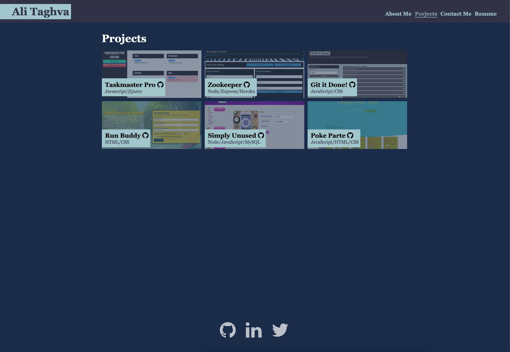

# Portfolio

## Table of Contents
* [Description](#description)
* [Installation](#installation)
* [Demo](#demo)
* [Contribution](#contribution)

## Description
This is SPA(single page application) which is made using React

## Installation
To install necessary dependecies, run the following command:

```
npm i
```

Make sure you have node installed on your machine
In order to run server, type the following command:

```
npm start
```

## Built with
* React
* JavaScript 

## Demo
[Portfolio](https://a-taghva.github.io/react-portfolio/)

[](https://a-taghva.github.io/react-portfolio/)


## Contribution
Made by Ali Taghva
